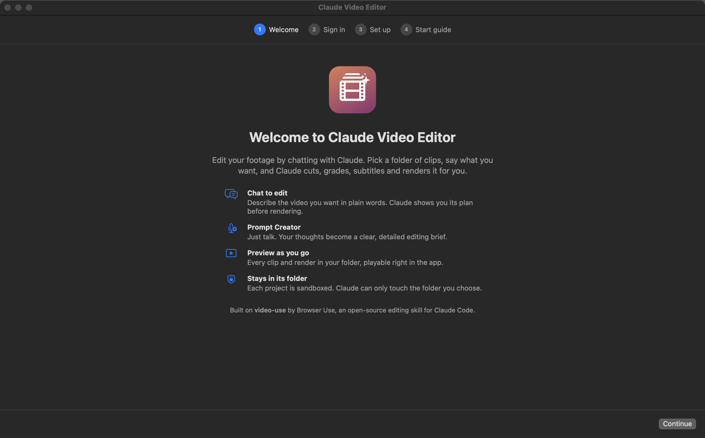
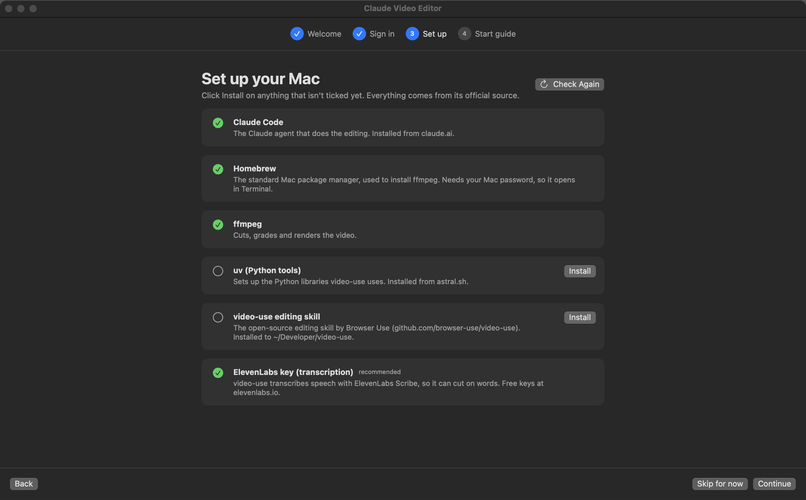

# Claude Video Editor

A Mac and Windows app for editing video by chatting with Claude. Pick a folder of footage, say what you
want ("make a 30-second 9:16 highlight reel, upbeat, cut on the action"), and Claude cuts,
grades, subtitles and renders it. You can watch every clip and render right in the app.

> **The editing itself is done by [video-use](https://github.com/browser-use/video-use)**, an
> open-source Claude Code skill by **[Browser Use](https://browser-use.com)** (originally
> written by Gregor Žunič, [@gregpr07](https://github.com/gregpr07)). This app is a desktop
> front end for it. See [Credits](#credits).



## Features

- **Sign in with Claude**: use your Claude Pro, Max, Team or Enterprise account (the same
  login as Claude Code), or an Anthropic API key stored in the macOS keychain or Windows
  Credential Manager.
- **Guided setup**: a checklist that installs everything video-use needs (Claude Code,
  ffmpeg, uv, video-use itself) from their official sources, with one click where possible.
- **Chat to edit**: one conversation per project, kept across restarts. Each command
  Claude runs appears as a collapsible step.
- **Quick actions**: ready-made requests (highlight reel, cut dead air, export 9:16,
  subtitles, color grade) that you can tweak before sending.
- **Prompt Creator**: press the mic, talk through what you want, and Claude turns your
  thoughts into a clear, detailed editing brief using your real clip names. Speech-to-text
  uses the system's built-in speech recognition.
- **Saved Prompts**: star any message you've sent to file it into a folder ("Reels",
  "Color"…), then reuse it from the **Saved** menu or the Library window.
- **Learns your style**: tell Claude a lasting preference ("I hate fast zooms") or use 👍 / 👎
  on its replies, and it's added to a Likes / Dislikes list that every edit and every Prompt
  Creator prompt follows. You can review and edit the list under **My Style**.
- **Clip browser and preview**: every video in the project, newest first, with renders
  tagged NEW. Drag a clip into the chat to refer to it.
- **Contained projects**: each project's Claude session works inside that folder only.
  On macOS that's enforced by a sandbox; on Windows, Claude asks you in the app before
  running commands. See [Security](#security).



## Install

**Requirements:** macOS 14 (Sonoma) or later, or Windows 10 (version 2004) or 11, plus a
Claude subscription or Anthropic API key.
An [ElevenLabs](https://elevenlabs.io) key (free tier available) is recommended: video-use
uses it to transcribe speech so it can cut on words.

### macOS

1. Download `Claude-Video-Editor-macOS-x.y.z.zip` from [Releases](../../releases) and unzip it.
2. Drag **Claude Video Editor** into your Applications folder.
3. The app isn't notarized by Apple, so the first time, **right-click it › Open › Open**.
   (Or run `xattr -dr com.apple.quarantine "/Applications/Claude Video Editor.app"`.)

### Windows

1. Download `Claude-Video-Editor-Windows-win-x64-x.y.z.zip` from [Releases](../../releases)
   (`win-arm64` for ARM PCs such as Snapdragon laptops) and unzip it anywhere.
2. Run **Claude Video Editor.exe**. It's a single file, and no installer or admin rights
   are needed.
3. The app isn't code-signed, so Windows SmartScreen may say "Windows protected your PC".
   Click **More info › Run anyway**.

The Windows build has been checked on GitHub's Windows machines (automated tests and
screenshots) but not yet on a real PC. Please [open an issue](../../issues) if something
doesn't work.

### Build from source: macOS (Apple Silicon or Intel)

```sh
xcode-select --install          # once, if you don't have the Command Line Tools
git clone https://github.com/ItzGhozt/claude-video-editor.git
cd claude-video-editor
./build.sh                      # -> dist/Claude Video Editor.app
```

Lines mentioning `xcrun ... PlatformPath` or XCTest during the build are harmless when
full Xcode isn't installed.

### Build from source: Windows

Install the [.NET 10 SDK](https://dotnet.microsoft.com/download), then:

```powershell
git clone https://github.com/ItzGhozt/claude-video-editor.git
cd claude-video-editor\windows\ClaudeVideoEditor
dotnet publish -c Release -r win-x64 --self-contained -p:PublishSingleFile=true -o out
```

## Getting started

On first launch the app walks you through four steps:

1. **Welcome**: what the app does.
2. **Sign in**: *Sign in with Claude* opens your browser. If the page shows a code, paste it
   back into the app. Or expand *Use an Anthropic API key instead*.
3. **Set up**: click **Install** on anything that isn't ticked. On macOS, Homebrew (needed
   for ffmpeg) asks for your Mac password, so its installer opens in Terminal. On Windows,
   ffmpeg and Git for Windows come from winget, and nothing needs admin rights.
4. **Start guide**: how to add a project, use quick actions and the Prompt Creator.

Then click **Add Folder…**, choose a folder of footage, and start chatting. The guide is
always available under **Help › Start Guide**. Account and setup live in
**Claude Video Editor › Settings**.

## Security

### macOS

Each project runs its own Claude Code session (`claude -p`, streaming JSON) with a
generated settings file ([`Sandbox.swift`](Sources/ClaudeVideoEditor/Sandbox.swift)):

- **Permission checks stay on.** Sessions use `acceptEdits` mode. Edits inside the project
  folder are auto-approved, and anything not explicitly allowed is refused (headless mode
  has no one to ask).
- **OS sandbox.** Every shell command runs under Claude Code's macOS sandbox: writes are
  allowed only in the project folder and a scratch folder. Documents, Desktop, Downloads,
  Pictures, Music, Library, `~/.ssh`, `~/.aws`, `~/.config` and past Claude transcripts are
  unreadable, and so is the rest of any of those folders when your project lives inside
  one. Commands can't opt out of the sandbox (`allowUnsandboxedCommands: false`).
- **Network allowlist.** Sandboxed commands can only reach ElevenLabs (transcription),
  PyPI, GitHub and npm (for helpers video-use installs on demand).
- Skills (video-use) are read-only to the session.
- The only place outside the project Claude may write is the style-preferences folder, so it
  can record likes and dislikes you tell it. The rest of the app's data, such as chat
  history, stays off-limits.

### Windows

Claude Code's OS sandbox isn't available on native Windows, so the Windows app relies on
permission checks, with you making the calls
([`SessionSettings.cs`](windows/ClaudeVideoEditor/Services/SessionSettings.cs)):

- Sessions run in `acceptEdits` mode with `--permission-prompts host`. Edits and simple file
  commands (`mkdir`, `cp`, `mv`…) inside the project are approved automatically. **Anything
  else, like running ffmpeg or Python, shows an approval card in the chat**: *Allow* (once),
  *Always allow* (that program, in this project) or *Deny*. "Always allow" is never offered
  for shells or `rm`/`del`.
- `blockReadsOutsideWorkingDirectories` makes Claude's file tools refuse paths outside the
  project, and deny rules cover Documents, Desktop, Downloads, Pictures, Videos, Music,
  AppData, OneDrive, `.ssh`, `.aws`, `.config` and past Claude transcripts (or, when the
  project is inside one of those, everything around it).
- Commands you approve run with your normal user permissions, so read the command on the
  card before you click Allow.

## Where things are stored

| What | Where |
| --- | --- |
| Chats | `~/Library/Application Support/Claude Video Editor/chats/` |
| Saved prompts | `~/Library/Application Support/Claude Video Editor/saved-prompts.json` |
| Style preferences (Likes / Dislikes) | `~/Library/Application Support/Claude Video Editor/memory/preferences.md` (the one app folder Claude may edit) |
| Per-project sandbox settings | `~/Library/Application Support/Claude Video Editor/sandbox/` |
| Anthropic API key (if used) | macOS keychain, service "Claude Video Editor" |
| video-use | `~/Developer/video-use`, linked at `~/.claude/skills/video-use` |
| ElevenLabs key | `~/Developer/video-use/.env` (where video-use reads it) |
| Claude account login | Managed by Claude Code (shared with the `claude` CLI) |

On Windows, chats, settings and preferences are in `%APPDATA%\Claude Video Editor\`, the API
key is in Credential Manager ("Claude Video Editor/anthropic-api-key"), and video-use is in
`%USERPROFILE%\Developer\video-use`, linked at `%USERPROFILE%\.claude\skills\video-use`.

## Development

**macOS:** SwiftUI plus Swift Package Manager; no Xcode project is needed.

- `swift build` compiles; `./build.sh` makes the `.app` (universal when full Xcode is
  installed, otherwise for this Mac only).
- Dev switches (environment variables): `CE_SNAPSHOT=out.png` saves images of the app's
  windows after `CE_SNAPSHOT_DELAY` seconds, `CE_ONBOARD_STEP=n` opens onboarding at step
  *n*, `CE_OPEN_PROMPT=1` opens the Prompt Creator, and `CE_TEST_SEND="…"` sends one message
  to the selected project on launch.

**Windows:** WPF on .NET 10 in [`windows/`](windows/). It also builds (compile only) on
macOS or Linux. `ClaudeVideoEditor.exe --self-test report.txt` checks the permission rules,
the stream parser and a live Claude Code session, and `--snapshot <dir>` saves a PNG of every
screen.

### CI and releases

[CI](.github/workflows/ci.yml) runs on every push and pull request. On macOS it does a
universal build, runs the self-test (`CE_SELF_TEST=report.txt`), including a live sandboxed
Claude Code session, and takes screenshots. On Windows it builds x64 and arm64, then runs
`--self-test` and `--snapshot`. Reports and screenshots are attached to each run as artifacts.

To publish a release, update `scripts/release-notes.md`, then push a tag:
`git tag v1.2.0 && git push origin v1.2.0`. The [release workflow](.github/workflows/release.yml)
reruns CI and, only if it passes, creates the GitHub release with the macOS and Windows zips.

## Credits

- **[video-use](https://github.com/browser-use/video-use)** by **Browser Use** does all of
  the editing: transcription, cutting, color grading, subtitles, animation overlays and
  self-review of renders. It was originally written by Gregor Žunič
  ([@gregpr07](https://github.com/gregpr07)) and is MIT-licensed, © 2026 Browser Use. This
  app downloads it from its official repository at setup time and doesn't include its code.
- **[Claude Code](https://code.claude.com)** by Anthropic runs each editing session.
- **[ffmpeg](https://ffmpeg.org)** renders the video (on Windows via the
  [gyan.dev](https://www.gyan.dev/ffmpeg/builds/) builds in winget), **[ElevenLabs Scribe](https://elevenlabs.io)**
  transcribes it (via video-use), and **[uv](https://github.com/astral-sh/uv)** by Astral
  sets up the Python environment.

See [CREDITS.md](CREDITS.md) for license texts. Claude Video Editor is an independent
project and isn't affiliated with or endorsed by Anthropic or Browser Use.

## License

[MIT](LICENSE)
